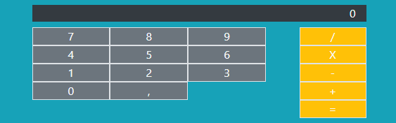

## Exercice 1

Définir une variable et l'afficher.
C'est un entier de valeur 6.
Afficher dans une boîte d'alerte.

## Exercice 2

Définir 3 variables : lastName, firstName et city.
Les afficher comme un formulaire prérempli avec votre nom, prénom et ville

## Exercice 3

Saisir son prénom dans un champ de formulaire, valider la saisie avec un bouton (écouteur d'événement)
Afficher dans une boîte de dialogue "Bonjour, " suivi du prénom saisi

## Exercice 4

Demander le nom, le prénom et la ville et afficher le résultat de l'ensemble dans une boîte de dialogue

## Exercice 5

Créer 2 boutons : 
1.augmenter (bleu)
2.diminuer (rouge)

[x] Partir de 0 pour le résultat
[x] Augmenter et diminuer avec un pas de 1
[x] Afficher le résultat en dynamique au dessus des boutons 

## Exercice 6 : devinerLeNombre

Afficher le titre du jeu : Deviner le nombre
Afficher "Deviner un nombre entre 1 et 100"
 - [x] au départ on a un bouton (bleu) "Cliquer pour jouer"
 - [ ] une fois qu'on a cliqué sur le bouton, on le fait disparaître et on le remplace par un champ qui permet d'écrire notre nombre et un bouton en dessous qui permet de valider ce nombre
 - [x] si le nombre est trop petit, indiquer au dessus du champ "c'est plus !!"
 - [x] si le nombre est trop grand, indiquer au dessus du champ "c'est moins !!"
 - [x] si le nombre correspond au nombre choisi au hasard on affiche "c'est gagné !!"
 - [ ] faire disparaître le champ et le bouton
 - [ ] proposer un bouton rejouer

## Exercice 7 : calculatrice (optionnel)

## Exercice 8 : survolImage

Afficher une image et lui rajouter une bordure rouge de 3px au survol

## Exercice 9 : motAleatoire

En partant du tableau suivant :
 - chocolat
 - pyramide 
 - automobile
 - synonyme 
 - lion
 - perpendiculaire

- [ ] Quand on clique sur un bouton "Cliquer ici !" cela nous trouve un mot au hasard dans le tableau et l'affiche à l'écran
- [ ] Le mot choisi au hasard est sauvegardé et on affiche à la place un ? pour chaque lettre du mot